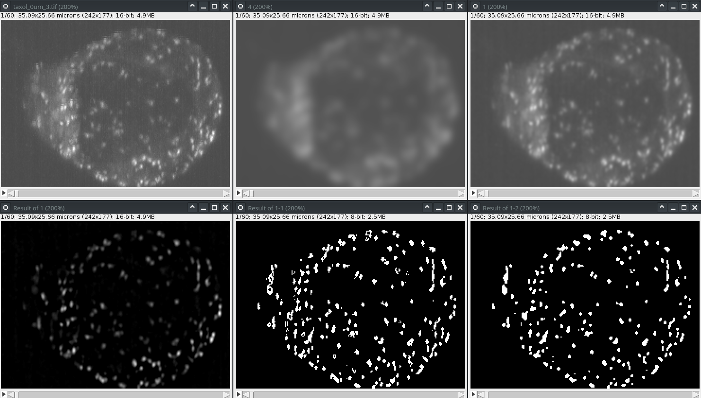
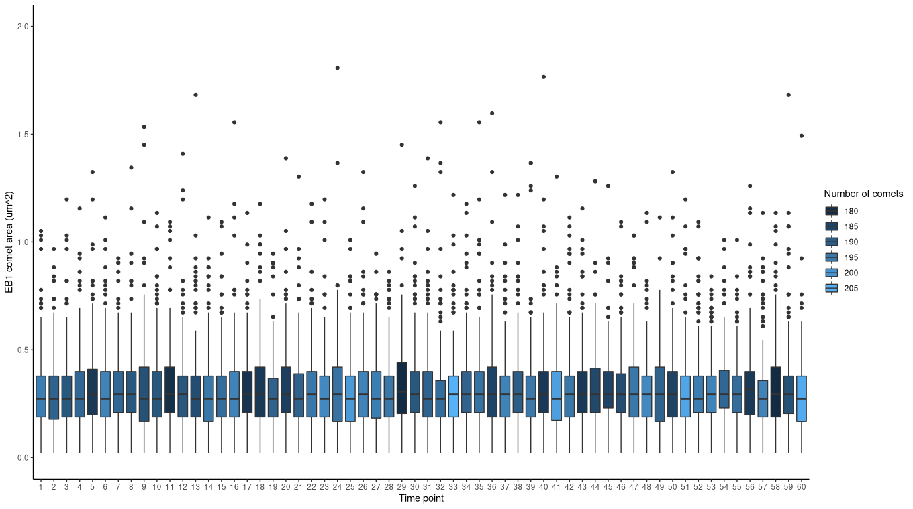
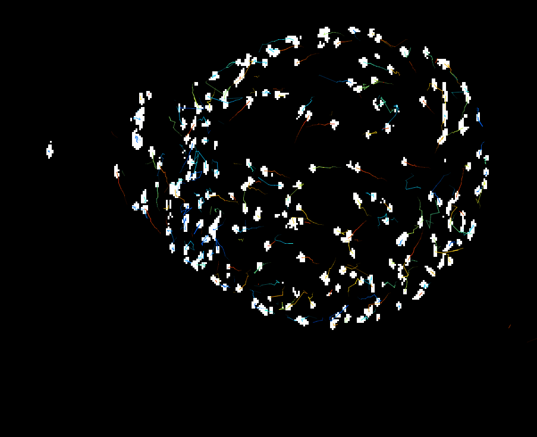
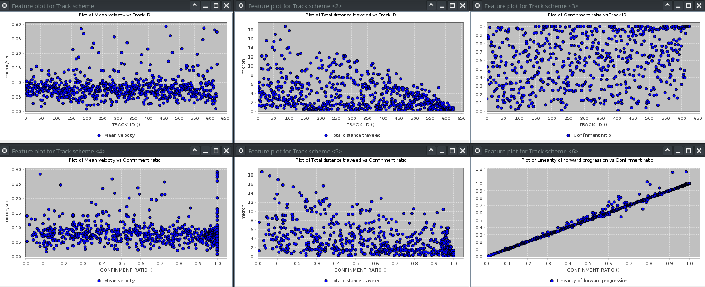

# Image analysis - progress report

---

## Pre-processing

Figure legend:

| **Original image**   | Gaussian blur (sigma=4) | Gaussian blur (sigma=1)    |
| -------------------- | ----------------------- | -------------------------- |
| **Subtracted image** | **Thresholded image**   | **Binary processed image** |

Pre-processing is necessary to make images analyzable. By applying a difference-of-Gaussian (DoG) filtering approach, I can remove most of the blur and enhance the contrast for analysis. With DoG, I am creating two blurred images, with different radii, and then subtracting one image from the other. Local thresholding (Bernsen), and binary processing (fill holes, despeckle, watershed) cleans up the image further.

---

## Comet size distribution

Figure legend: Area distribution of EB1 comets over 60 frames (3 minutes total time).

Particle analysis yields the area, and number of comets in each frame. As we can see, both numbers are stable over time in this cell. 

---

## Comet tracking

Figure legend: EB1 tracks color coded according to linearity (red = linear, blue = curved).

Having pre-processed the image, I can utilize the trackmate plugin for particle tracking.

Figure legend: Statistics for varying features.

| Mean velocity              | Travel distance            | Linearity                        |
| -------------------------- | -------------------------- | -------------------------------- |
| **Linearity vs. velocity** | **Linearity vs. distance** | **Linearity vs linear velocity** |

A lot of statistics can be gained from analyzing tracks. Here are a few examples.

- The mean velocity is more or less constant, a few track move exceptionally fast.
- Most tracks are short (below 5 um)
- There are both linear and curved tracks.
- Velocity and linearity are not correlated
- Curved tracks travel for longer
- Linear velocity is correlated to linearity

---